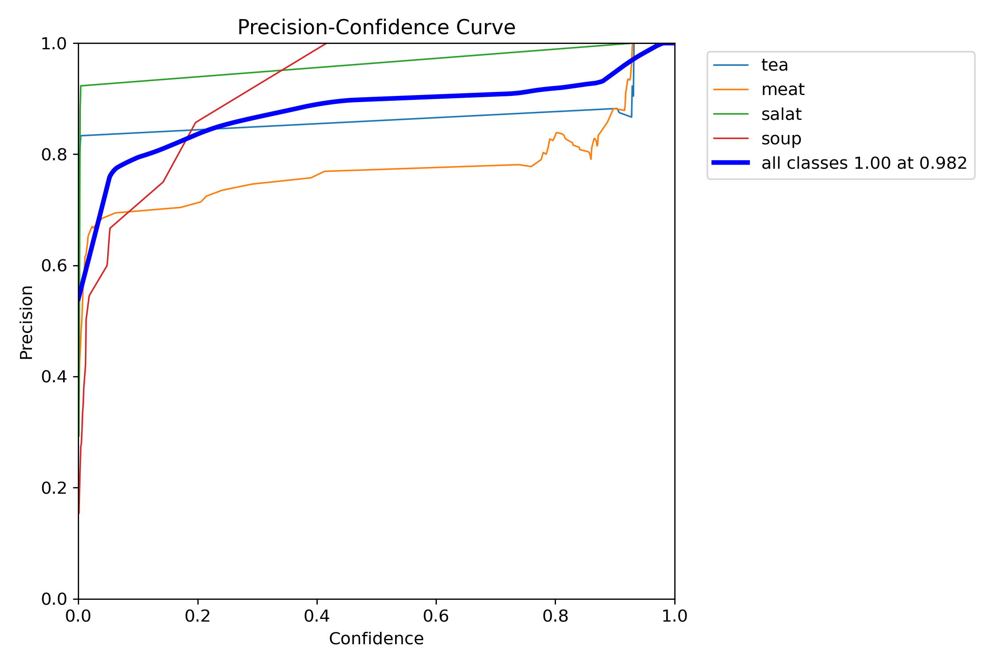
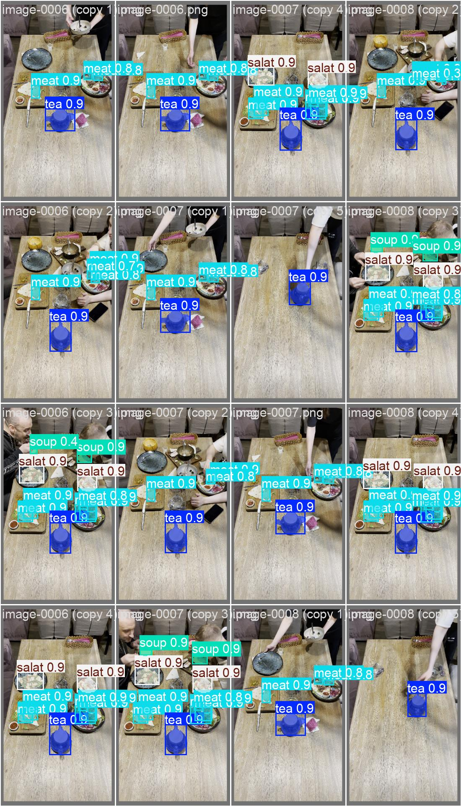

# Отчет о проделанной работе с обучением модели YOLOv11

## Обзор проекта

**Задача:** Распознавание объектов на видео с использованием YOLOv11 для 4 классов: tea, meat, salad, soup

**Используемые технологии:**
- YOLOv11 (Ultralytics)
- OpenCV для обработки видео
- PyTorch для обучения нейронной сети
- Python для скриптинга

## 1. Подготовка данных

### 1.1 Извлечение кадров из видео

Для извлечения кадров из видео был создан скрипт `split_video.py`:
```python
# Основные параметры извлечения
fps = 1.5  # кадры в секунду
format = PNG  # формат выходных изображений
```

**Результат:** Извлечение кадров с частотой 1.5 FPS для последующей аннотации

### 1.2 Настройка CVAT для аннотации

**Инфраструктура:**
- CVAT развернут локально в Docker контейнере
- Создан проект для аннотации 4 классов объектов

### 1.3 Итеративный подход к аннотации данных

#### Этап 1: Ручная аннотация базового набора
**Первоначальная разметка в CVAT:**
- **45 изображений** размечены вручную для 4 классов:
  - **tea** (чай)
  - **meat** (мясо) 
  - **salad** (салат)
  - **soup** (суп)
- **Разделение:** 30 изображений на train, 15 на validation

#### Этап 2: Обучение базовой модели
- Обучение YOLOv11s-seg на малом датасете (200 эпох)
- Получение модели для автоматической аннотации

#### Этап 3: Автоматическая аннотация
**Использованные инструменты:**
- [AutoCVAT](https://github.com/BelickNicko/AutoCVAT) - для автоматической аннотации остальных изображений
- [COCO_to_YOLOv8](https://github.com/Koldim2001/COCO_to_YOLOv8) - для конвертации COCO формата в YOLO

**Процесс:**
1. Базовая модель использована для предсказания на всех оставшихся кадрах
2. Автоматические аннотации импортированы в CVAT
3. Проведена ручная корректировка автоматических аннотаций

### 1.4 Финальная структура датасета

```
YOLO_dataset/
├── data.yaml          # Конфигурация датасета
├── train/
│   ├── images/        # 361 тренировочное изображение
│   └── labels/        # 361 файл аннотаций
└── validation/
    ├── images/        # 138 валидационных изображений
    └── labels/        # 138 файлов аннотаций
```

**Финальное разделение данных:**
- Тренировочный набор: 361 изображение (~72%)
- Валидационный набор: 138 изображений (~28%)
- **Всего изображений: 499** (увеличение с 45 до 499 за счет автоаннотации)

## 2. Обучение модели

### 2.1 Конфигурация обучения

**Базовая модель:** YOLOv11s-seg (сегментация)
**Размер изображения:** 640x640
**Тип задачи:** Instance segmentation

### 2.2 Эксперименты обучения

#### Эксперимент 1: Базовая модель (малый датасет)
```yaml
epochs: 200
batch_size: 8
learning_rate: 0.01
device: cpu
optimizer: auto
dataset_size: 45 изображений (30 train + 15 val)
```

**Цель:** Создать базовую модель для автоматической аннотации

**Результаты:**
- **Время обучения:** ~2-3 часа
- **mAP50 (Box):** 0.9519
- **mAP50-95 (Box):** 0.8106  
- **mAP50 (Mask):** 0.9250
- **mAP50-95 (Mask):** 0.7840
- **Применение:** Модель использована для автоаннотации остальных 454 изображений

#### Эксперимент 2: Финальная модель (полный датасет)
```yaml
epochs: 20
batch_size: 16
learning_rate: 0.01
device: cpu
optimizer: auto
dataset_size: 499 изображений (361 train + 138 val)
```

**Цель:** Обучить финальную модель на расширенном датасете

**Результаты:**
- **Время обучения:** ~4.6 часа
- **mAP50 (Box):** 0.9913 ⭐
- **mAP50-95 (Box):** 0.9659 ⭐
- **mAP50 (Mask):** 0.9836
- **mAP50-95 (Mask):** 0.8891
- **Статус:** Лучшая модель для практического применения

#### Эксперимент 3: Быстрое тестирование
```yaml
epochs: 2
batch_size: 16
learning_rate: 0.01
device: cpu
optimizer: auto
dataset_size: 499 изображений (361 train + 138 val)
```

**Цель:** Проверить быструю сходимость модели

**Результаты:**
- **Время обучения:** ~8 минут
- **mAP50 (Box):** 0.9851
- **mAP50-95 (Box):** 0.8760
- **mAP50 (Mask):** 0.9831
- **mAP50-95 (Mask):** 0.8194

## 3. Анализ результатов

### 3.1 Сравнение экспериментов

| Эксперимент   |      Датасет    | Эпохи | Batch | Время |  mAP50(B)  | mAP50-95(B) |  mAP50(M)  | mAP50-95(M) |     Цель      |
|---------------|-----------------|-------|-------|-------|------------|-------------|------------|-------------|---------------|
| 1 (Базовая)   | 45 изображений  | 200   | 8     | ~2ч   |   0.9519   |   0.8106    |   0.9250   |    0.7840   | Автоаннотация |
| 2 (Финальная) | 499 изображений | 20    | 16    | ~4.6ч | **0.9913** | **0.9659**  | **0.9836** |  **0.8891** | **Продакшн**  |
| 3 (Тест)      | 499 изображений | 2     | 16    | ~8мин |   0.9851   |   0.8760    |   0.9831   |    0.8194   |   Проверка    |

### 3.2 Ключевые выводы

1. **Итеративный подход:** Стратегия "малый датасет → базовая модель → автоаннотация → большой датасет → финальная модель" оказалась очень эффективной
2. **Эффект размера датасета:** Увеличение с 45 до 499 изображений кардинально улучшило качество модели
3. **Автоматическая аннотация:** Использование предобученной модели для разметки сэкономило ~90% времени на аннотацию
4. **Оптимизация параметров:** Увеличение batch_size с 8 до 16 значительно улучшило результаты
5. **Быстрая сходимость:** На большом датасете модель показывает отличные результаты уже после 20 эпох
6. **Экосистема инструментов:** Использование специализированных библиотек (AutoCVAT, COCO_to_YOLOv8) значительно ускорило workflow

### 3.3 Финальные метрики лучшей модели

**Эксперимент 2 (20 эпох, batch=16):**
- Precision (Box): 0.9875
- Recall (Box): 0.9896  
- F1-Score: ~0.9885
- **mAP50 (Box): 0.9913** ⭐
- **mAP50-95 (Box): 0.9659** ⭐

## 4. Техническая реализация

### 4.1 Структура проекта
```
zebra/
├── dataset/                 # Исходные данные
├── YOLO_dataset/           # Подготовленный датасет
├── runs/segment/           # Результаты обучения
├── split_video.py          # Извлечение кадров
├── train_yolo.py          # Обучение модели
├── check.py               # Тестирование модели
└── requirements.txt       # Зависимости
```

### 4.2 Инфраструктура и инструменты

**Аннотация данных:**
- **CVAT** - развернут локально в Docker для создания аннотаций
- **Docker** - контейнеризация CVAT для изоляции окружения

**Автоматизация workflow:**
- [**AutoCVAT**](https://github.com/BelickNicko/AutoCVAT) - автоматическая аннотация изображений в CVAT
- [**COCO_to_YOLOv8**](https://github.com/Koldim2001/COCO_to_YOLOv8) - конвертация аннотаций из COCO в YOLO формат

**Python зависимости:**
```
ultralytics>=8.0.0
opencv-python>=4.8.0
matplotlib>=3.7.0
numpy>=1.24.0
torchvision>=0.15.0
```

### 4.3 Скрипт обучения
```python
from ultralytics import YOLO

model = YOLO('yolo11s-seg.pt')
results = model.train(
    data='YOLO_dataset/data.yaml', 
    epochs=20, 
    imgsz=640, 
    batch=16
)
```

### 4.4 Тестирование модели
```python
model = YOLO("runs/segment/train/weights/best.pt")
results = model(img, imgsz=640, iou=0.4, conf=0.7)
```

## 5. Визуализация результатов

### 5.1 График метрик обучения


*График показывает динамику основных метрик во время обучения: Box loss, Mask loss, mAP50, mAP50-95 и другие показатели*

### 5.2 Матрицы ошибок


*Матрицы ошибок показывают качество классификации для каждого из 4 классов: tea, meat, salad, soup*

### 5.3 Кривые метрик для сегментации масок




*Кривые показывают качество сегментации масок для каждого класса при различных порогах уверенности*

### 5.4 Распределение классов в датасете


*Визуализация показывает распределение объектов по классам, размерам и позициям в датасете*

### 5.5 Примеры результатов на валидационных данных





*Сравнение истинных меток (labels) и предсказаний модели (pred) на валидационных данных*

### 5.6 Примеры тренировочных батчей


*Примеры изображений из тренировочного набора с аннотациями*

## 6. Практические примеры применения модели

### 6.1 Демонстрация работы финальной модели

Ниже представлены примеры работы обученной модели на новых изображениях:

**Пример 1:**

Исходное изображение:


Результат предсказания:


**Пример 2:**

Исходное изображение:


Результат предсказания:


**Пример 3:**

Исходное изображение:


Результат предсказания:


*Примеры демонстрируют способность модели точно определять и сегментировать объекты всех 4 классов: tea (чай), meat (мясо), salad (салат), soup (суп)*

## 7. Сложности и их решения

### 7.1 Технические сложности
- **Ограниченные вычислительные ресурсы:** Обучение проводилось на CPU так как ноутбук имеет только интегрированую графику AMD которую не поддерживает ROCm
- **Малый начальный датасет:** Всего 45 размеченных изображений
- **Масштабирование аннотации:** Необходимость разметить сотни дополнительных изображений
- **Интеграция инструментов:** Настройка pipeline CVAT → COCO → YOLO

### 7.2 Решения
- **Итеративный подход:** Базовая модель → автоаннотация → финальная модель
- **Использование готовых решений:** Интеграция AutoCVAT и COCO_to_YOLOv8
- **Локальный CVAT в Docker:** Полный контроль над процессом аннотации
- **Оптимизация параметров:** Настройка batch_size и количества эпох

## 8. Выводы и рекомендации

### 8.1 Основные достижения
✅ **Реализован итеративный подход:** Базовая модель → автоаннотация → финальная модель  
✅ **Масштабирование датасета:** Увеличение с 45 до 499 изображений за счет автоматизации  
✅ **Высокие метрики:** mAP50 = 99.13%, mAP50-95 = 96.59%  
✅ **Эффективная автоматизация:** Экономия ~90% времени на аннотацию  
✅ **Интеграция инструментов:** CVAT + AutoCVAT + COCO_to_YOLOv8 + YOLOv11  
✅ **Воспроизводимая pipeline:** От видео до готовой модели  

### 7.2 Рекомендации для улучшения
1. **Использование GPU** для ускорения обучения (сократит время с 47ч до ~2ч)
2. **Аугментация данных** для увеличения разнообразия датасета

## 8. Время выполнения

**Общее время работы над проектом:** ~60 часов

**Детализация по этапам:**
- **Настройка CVAT в Docker:** ~4 часа
- **Ручная разметка 45 изображений:** ~12 часов  
- **Обучение базовой модели (200 эпох):** ~3 часов
- **Настройка AutoCVAT и автоаннотация:** ~1 часов
- **Конвертация и подготовка финального датасета:** ~2 часа
- **Обучение финальной модели (20 эпох):** ~3 часа
- **Анализ результатов и написание отчета:** ~4 часов

**Активное время разработки:** ~20 часов  
**Время ожидания обучения:** ~6-7 часов

## 9. Опыт работы с YOLO

**Предыдущий опыт:** Это мой первый опыт. 
- Знакомство с концепцией YOLO на теоретическом уровне
- Базовые знания в области computer vision
- Никогда не обучал YOLO модели с нуля

**Полученные навыки в ходе проекта:**
- Практическое использование YOLOv11 для задач сегментации
- Работа с экосистемой Ultralytics
- Интеграция CVAT с ML pipeline
- Автоматизация процесса аннотации через AutoCVAT
- Конвертация форматов данных (COCO → YOLO)
- Анализ метрик качества моделей компьютерного зрения
- Итеративный подход к улучшению качества модели

---

*Отчет подготовлен в рамках тестового задания на позицию Python Developer (Computer Vision, ML)* 